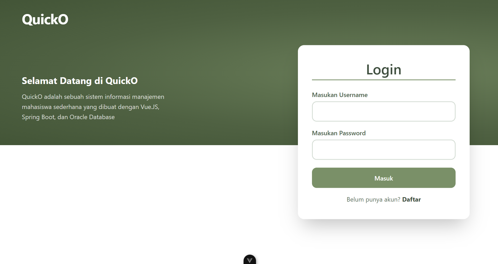
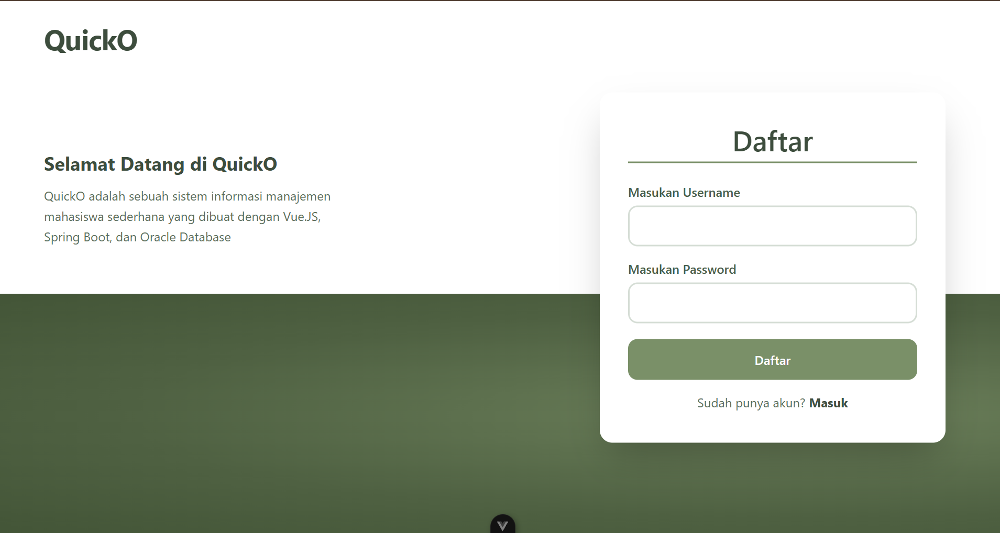
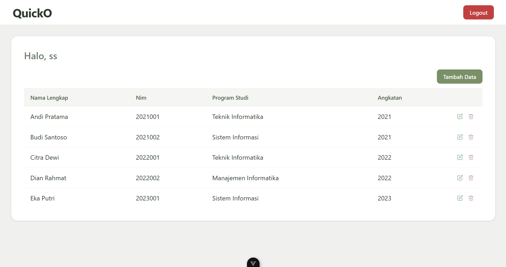
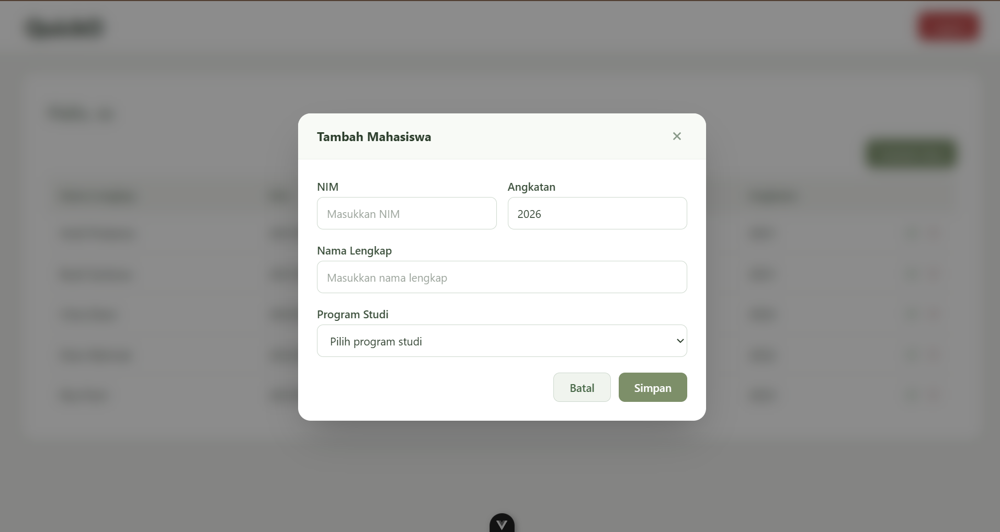
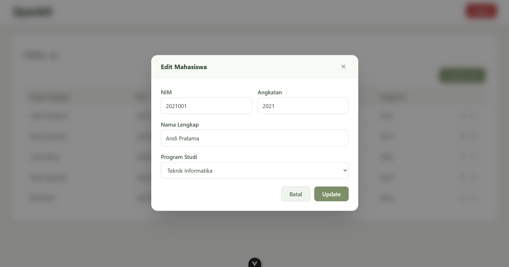
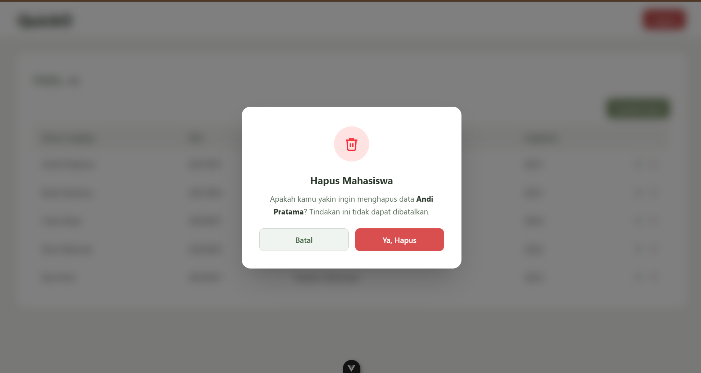

# QuickO — Sistem Manajemen Data Mahasiswa

QuickO adalah aplikasi **Single Page Application (SPA)** berbasis **Vue 3 + TypeScript + Tailwind CSS v4** yang berfungsi sebagai _frontend client_ untuk mengelola data mahasiswa. Aplikasi ini terhubung ke backend **Spring Boot** (repository terpisah) melalui REST API untuk operasi CRUD (Create, Read, Update, Delete). Saat backend tidak tersedia, aplikasi tetap dapat berjalan dalam **mode demo** dengan data _mock_ yang disimpan di memori, sehingga memudahkan pengembangan dan demonstrasi tanpa ketergantungan penuh pada server.

Antarmuka dirancang responsif dengan palet warna _olive-green_, menggunakan font **Poppins**, serta mendukung autentikasi pengguna berbasis token JWT. Aplikasi ini cocok sebagai proyek pembelajaran integrasi Vue 3 dengan REST API maupun sebagai fondasi sistem informasi akademik sederhana.

---

## Fitur Utama

- **Autentikasi Pengguna** — Login dan registrasi dengan username/password, token JWT disimpan di `localStorage`.
- **CRUD Data Mahasiswa** — Tambah, lihat, edit, dan hapus data mahasiswa melalui modal interaktif.
- **Mode Demo** — Saat backend tidak aktif, seluruh operasi CRUD berjalan di memori dengan data _mock_.
- **Validasi Form** — Validasi _client-side_ untuk NIM, nama, program studi, dan tahun angkatan.
- **Navigasi Terproteksi** — Halaman mahasiswa hanya bisa diakses setelah login.
- **Desain Responsif** — Dibangun dengan Tailwind CSS v4, tampil optimal di berbagai ukuran layar.
- **Notifikasi Backend** — Banner informasi muncul saat aplikasi berjalan dalam mode demo/maintenance.

---

## Instalasi & Menjalankan Proyek

### Prasyarat
- **Node.js** `^20.19.0` atau `>=22.12.0`
- **npm** (terinstal bersama Node.js)

### Langkah Instalasi

```sh
# 1. Clone repositori
git clone https://github.com/BenedictoGeraldo/mahasiswa-crud-vue.git
cd mahasiswa-crud-vue

# 2. Install dependensi
npm install
```

### Menjalankan Development Server

```sh
npm run dev
```

Akses di `http://localhost:5173`. Hot Reload aktif — perubahan kode langsung tampil tanpa _refresh_ manual.

### Build Produksi

```sh
npm run build
```

Hasil build ada di folder `dist/`, siap di-deploy ke _static hosting_ (Netlify, Vercel, Nginx, dsb).

### Preview Build Produksi

```sh
npm run preview
```

### Kredensial Demo (Mode Mock)

| Username | Password |
|----------|----------|
| `admin`  | `password` |

> **Catatan:** Kredensial di atas hanya berlaku saat mode demo (`API_ENABLED = false` di `src/config.ts`). Untuk mode produksi, backend Spring Boot harus berjalan di `http://localhost:8080`.

---

## Struktur Proyek

```
mahasiswa-crud-vue/
├── public/
│   └── favicon.ico                  # Ikon aplikasi
├── src/
│   ├── main.ts                      # Entry point Vue app
│   ├── App.vue                      # Root component (notice + router-view)
│   ├── config.ts                    # Konfigurasi global (API flag, repo URL)
│   │
│   ├── api/                         # HTTP client & API layer
│   │   ├── client.ts                # Axios instance + interceptor auth
│   │   ├── auth.ts                  # Endpoint login & register
│   │   └── mahasiswa.ts             # Endpoint CRUD mahasiswa
│   │
│   ├── composables/                 # Custom composable (state management)
│   │   └── useMahasiswaStore.ts     # Shared state + aksi CRUD + mock fallback
│   │
│   ├── router/
│   │   └── index.ts                 # Konfigurasi Vue Router (4 rute)
│   │
│   ├── types/
│   │   └── index.ts                 # Interface TypeScript (Mahasiswa, Auth)
│   │
│   ├── views/                       # Komponen halaman
│   │   ├── LoginView.vue            # Halaman login
│   │   ├── RegisterView.vue         # Halaman registrasi
│   │   └── MahasiswaView.vue        # Dashboard CRUD mahasiswa
│   │
│   ├── components/                  # Komponen reusable
│   │   ├── BackendNotice.vue        # Banner mode demo/maintenance
│   │   ├── MahasiswaFormModal.vue   # Modal form tambah/edit mahasiswa
│   │   └── DeleteConfirmModal.vue   # Modal konfirmasi hapus
│   │
│   └── assets/
│       └── main.css                 # Tailwind + font Poppins + base reset
│
├── screenshots/                     # Tangkapan layar aplikasi
├── index.html                       # HTML entry point
├── package.json                     # Metadata & dependensi
├── vite.config.ts                   # Konfigurasi Vite
├── tsconfig.json                    # Konfigurasi TypeScript
└── README.md
```

---

## Screenshots

### Halaman Login


### Halaman Registrasi


### Daftar Mahasiswa


### Tambah Mahasiswa


### Edit Mahasiswa


### Hapus Mahasiswa

